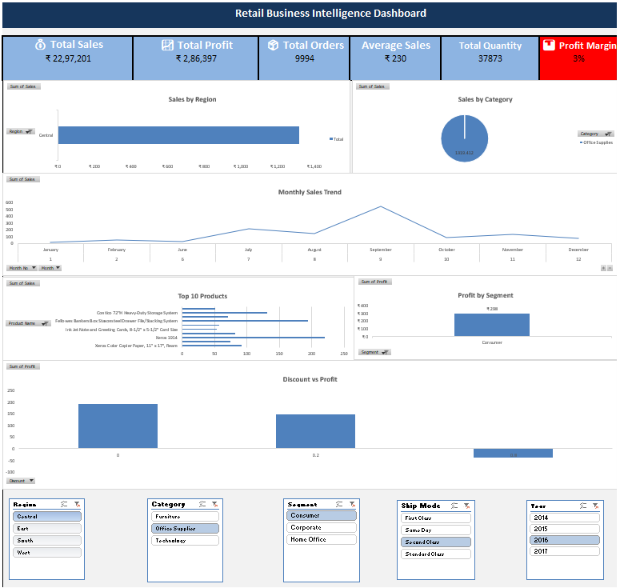

# Retail-Business-Intelligence-Dashboard-Excel
An interactive Retail Business Intelligence Dashboard built in Microsoft Excel to analyze sales performance and generate actionable business insights.

# 📊 Retail Business Intelligence Dashboard (Microsoft Excel)

## 📌 Project Overview

This project is an interactive **Retail Business Intelligence Dashboard** built using Microsoft Excel. It transforms raw retail sales data into meaningful business insights through interactive visualizations and KPI tracking.

---

## 🚀 Features

- 📈 KPI Cards (Total Sales, Total Profit, Total Orders, Average Sales, Total Quantity & Profit Margin)
- 📊 Pivot Tables & Pivot Charts
- 🎯 Interactive Slicers
- 🌍 Sales by Region
- 🛒 Sales by Category
- 📅 Monthly Sales Trend
- 🏆 Top 10 Products Analysis
- 💰 Profit by Segment
- 📉 Discount vs Profit Analysis

---

## 🛠️ Tools Used

- Microsoft Excel
- Pivot Tables
- Pivot Charts
- Slicers
- Data Analysis

---

## 📷 Dashboard Preview

---

## 📂 Project Files

- 📄 Retail-Business-Intelligence-Dashboard.xlsx
- 🖼 Dashboard.png

---

## 🎯 Key Insights

- Identified sales performance across different regions.
- Analyzed product category performance.
- Tracked monthly sales trends.
- Compared profit across customer segments.
- Evaluated the relationship between discount and profit.

---

## 👨‍💻 Author

**Achintya Agrawal**

Aspiring Data Analyst

🔗 LinkedIn: https://www.linkedin.com/in/achintya-agrawal-966861325/
